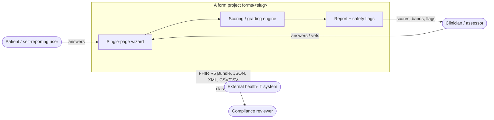

# 3. Context and Scope

## 3.1 Business context

A form is filled in by a **patient / self-reporting user** or a **clinician /
assessor**, and produces a graded **report** with **safety flags**, plus
machine-readable exchange documents for downstream systems.

| Party | Provides | Receives |
| ----- | -------- | -------- |
| Patient / self-reporting user | Questionnaire answers | Report preview; PDF |
| Clinician / assessor | Answers and/or vetting sign-off | Scores, bands, triage tier, flagged issues; dashboard list |
| External health-IT system | — | FHIR R5 Bundle, JSON, XML, CSV/TSV export |
| Compliance reviewer | Regulatory framework | Declared device classification and attestations |

## 3.2 Technical context

Each form is a set of artefacts derived from one schema and exchanged through
standard formats. The system has **no shared runtime**; the "external
interfaces" are the file/format contracts each form satisfies.

| Interface | Format / standard | Direction |
| --------- | ----------------- | --------- |
| Data shape (source of truth) | PostgreSQL SQL migrations | internal source |
| Structured document | XML + DTD per entity | export |
| Health interoperability | **FHIR HL7 R5** JSON per entity; FHIR R5 Bundle sample | export / exchange |
| Wire schema | **Protocol Buffers** `.proto` per entity | export |
| API description | **OpenAPI 3.1** YAML per entity | contract |
| Runtime API | JSON over HTTP (axum + Loco), canonical `/api/assessments` | request/response |
| Draft persistence | Browser LocalStorage (`<slug>.front-end-with-{html,svelte}.v1`) | client-side |
| Tabular import/export | JSON, XML, CSV, TSV | import / export |
| Observability | OpenTelemetry OTLP; Prometheus `/metrics` | export (back-end) |

## 3.3 Scope

**In scope:** per-form schema; generated representations; four front-ends per
form (form + dashboard, each in HTML and SvelteKit); one Rust back-end JSON API
per form; cross-cutting documentation, agent instructions, and verification
gates.

**Out of scope (today):** hosted deployment, infrastructure, authentication,
multi-tenancy; a unified backend serving every form; internationalisation
beyond the English + Welsh pilot. See [§7 Deployment View](07-deployment-view.md)
and [§11 Risks](11-risks-and-technical-debt.md).
