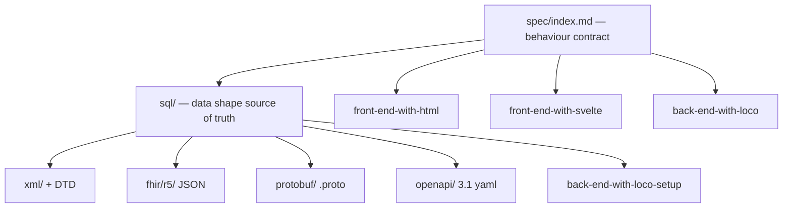

# 4. Solution Strategy

Five strategic decisions carry the whole system. Each maps to a quality goal
from [§1.2](01-introduction-and-goals.md) and is expanded in
[§8 Cross-cutting Concepts](08-cross-cutting-concepts.md) and
[§9 Architecture Decisions](09-architecture-decisions.md).

## 4.1 One shared design, N domains

The organising thesis: **a single uniform design is instantiated once per
domain.** Every form has the identical directory layout, the identical engine
file decomposition (`types → rules → grader → flagged-issues`), the identical
UI class vocabulary (Lily), and the identical API surface
(`/api/assessments`). Uniformity is the product; a new form is a new *instance*
of the pattern, scaffolded by `bin/create-form`. → *quality: uniformity.*

## 4.2 SQL → generated representations pipeline

`forms/<slug>/sql/` is the single source of truth for data shape. Python
generators project it to XML/DTD, FHIR R5 JSON, Protocol Buffers, and OpenAPI
3.1, plus the Loco scaffold script. Generated artefacts are never hand-edited;
correctness is proven by regenerating and observing **zero drift**.
→ *quality: correctness, interoperability.*

## 4.3 Pure scoring engines, mirrored across stacks

Each form's grading logic is a **pure engine** split into small files, and the
same shape (same rule IDs, same flag IDs) is implemented three times — in the
HTML front-end (`js/{types,rules,grader,flags}.js`), the Svelte front-end
(`src/lib/engine/`), and the Rust back-end (`src/<snake>/engine/`). Purity
makes the logic unit-testable and keeps the three implementations in agreement.
→ *quality: correctness, uniformity.*

## 4.4 Lily headless design system

The **Lily Design System** is consumed as a *contract* (a class vocabulary and
ARIA/keyboard behaviour), not a runtime dependency. One class vocabulary
(`text-input`, `radio-group`, `step-list`, `field`, `button`, …) serves both
the HTML and the Svelte front-ends, so a single stylesheet dresses both and the
accessibility commitments are shared. → *quality: accessibility, uniformity.*

## 4.5 Verification as contract

Correctness is *demonstrated*, not asserted. A family of `bin/…--check` drift
detectors and test gates make every invariant executable: structure validity,
SQL apply, generated-artefact drift, Lily contract drift, spec presence, and
Loco config drift. A green run is the acceptance criterion. → *quality:
correctness, maintainability.* See [§10 Quality Requirements](10-quality-requirements.md).
