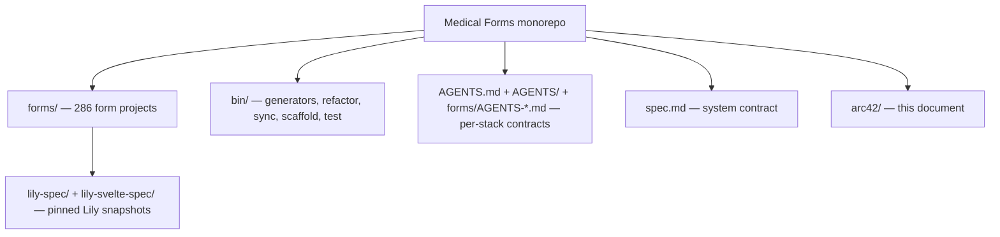

# 5. Building Block View

## 5.1 Level 0 — the monorepo



The top-level building blocks are: the **form projects** (the payload), the
**`bin/` toolchain** (which generates and verifies them), the **agent/spec
docs** (the contracts), and the pinned **Lily spec snapshots**.

## 5.2 Level 1 — the per-form directory (the building block)

The unit of composition is one form directory. Every form has the same layout
(`spec.md` §4 is the authoritative contract; `bin/test-form <slug>` asserts each
path exists and is non-empty):

```
forms/<slug>/
  index.md, README.md->index.md, AGENTS.md, CLAUDE.md   # docs (author)
  spec/index.md (+ README.md symlink)                    # living domain spec (author)
  plan.md, tasks.md, CHANGELOG.md, doc/, examples/       # planning + reference (author)
  sql/                     # PostgreSQL migrations — SOURCE OF TRUTH (author)
  xml/                     # XML + DTD per entity        (generated)
  fhir/r5/                 # FHIR HL7 R5 JSON per entity (generated)
  protobuf/                # Protocol Buffers .proto      (generated)
  openapi/                 # OpenAPI 3.1 yaml             (generated)
  front-end-with-html/     # wizard (index.html) + dashboard (dashboard.html) + shared css/js  (author + Lily refactor)
  front-end-with-svelte/   # SvelteKit app; RESTful routes under src/routes/<slug>/            (author)
  back-end-with-loco/      # Rust JSON API crate; source under src/<snake>/                     (author)
  back-end-with-loco-setup # cargo loco scaffold script  (generated)
```

Ownership and generation status per path is tabulated in `spec.md` §4. The
distinction that matters: **author-owned** (SQL, specs, engines, front-ends,
back-end) versus **generated** (XML, FHIR, protobuf, OpenAPI, Loco setup).

## 5.3 Level 1 — the `bin/` toolchain

The toolchain is the machine that keeps 286 forms uniform. Grouped by role:

| Group | Tools (selected) | Role |
| ----- | ---------------- | ---- |
| Scaffold & test | `create-form`, `test`, `test-form`, `test-sql-apply`, `test-tools` | Create a form; validate structure; apply SQL to a scratch DB |
| SQL | `migrate-sql-filenames.py`, `sql/generate-sql-comments.py`, `sql/generate-sql-combined.py` | Canonical filenames; SQL comments; combined `schema.sql` |
| Generators | `xml-representations/…`, `fhir-r5/…`, `protobuf/…`, `openapi/…`, `back-end-with-loco/…` | SQL → derived representations |
| Lily (HTML) | `lily-html-refactor`, `lily-sync` | Mechanical class swaps + drift; spec snapshot |
| Lily (Svelte) | `lily-svelte-refactor`, `lily-svelte-status`, `lily-svelte-sync` | Class swaps + conformance report; spec snapshot |
| Loco | `loco-config-refactor` | Background-queue + observability convention drift |
| Specs & docs | `generate-llms-txt.py`, `generate-spec.py`, `generate-changelog-and-examples.py` | Per-form `llms.txt`, `spec/`, `CHANGELOG` + `examples/` |

Most tools accept `--check` (CI drift detector) and `--dry-run`.

## 5.4 Level 2 — one form decomposed (`cardiology-request`)

The canonical HTML reference. Its `sql/` directory shows the standard
relational shape (shared entities + a per-form core table + a grading trio):

```
sql/
  00_create_extensions.sql
  01_create_function_set_updated_at.sql
  02_create_table_patient.sql                       # shared demographic entity
  03_create_table_clinician.sql                     # shared clinician entity
  04_create_table_cardiology_request.sql            # the form's core record
  05_create_table_cardiology_request_grade.sql      # computed grade (1:1)
  06_create_table_cardiology_request_grade_rule.sql # audit of fired rules (1:N)
  07_create_table_cardiology_request_grade_flag.sql # safety flags (1:N)
```

- **`patient` / `clinician`** — shared demographic entities (UUID PK; the
  standard timestamp trio).
- **`<form>`** — the core submitted record (the questionnaire answers).
- **`<form>_grade`** — the engine's computed result for that record: the
  scoring axes (e.g. cardiology's four axes — appropriateness, safety,
  completeness, triage), the recommendation, and sign-off.
- **`<form>_grade_rule`** — one row per scoring rule that fired (`rule_id`,
  `axis`, `category`, `description`): the audit trail.
- **`<form>_grade_flag`** — one row per safety-critical flag that fired
  independently of the axes (`flag_id`, `category`, `priority`, `description`,
  `suggested_action`).

Forms with richer domains add more child tables. For example
`medical-operation-note` adds `_team_member`, `_procedure`, `_step`, `_implant`,
`_drain`, `_specimen`, `_complication` alongside the same `_grade` / `_grade_rule`
/ `_grade_flag` trio — the pattern scales by adding relational child tables, not
by widening one table. See [ADR-1](09-architecture-decisions.md).

The two front-ends and the Loco crate each carry a mirror of the scoring
engine (`types → rules → grader → flagged-issues`) that reads the `<form>`
record and writes the `<form>_grade` + `_grade_rule` + `_grade_flag` result.
