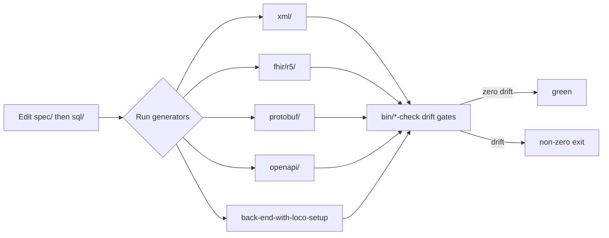

# 6. Runtime View

Three runtime scenarios matter: the front-end wizard flow, the back-end
JSON-API request flow, and the (build-time) generator pipeline run.

## 6.1 Wizard → scoring engine → report (front-end)

Both front-ends (HTML and Svelte) share this flow. The wizard is a single-page,
step-by-step questionnaire with LocalStorage autosave; on submit it runs the
pure engine locally and renders the report region.

```mermaid
sequenceDiagram
  actor User
  participant Wizard as Wizard (steps)
  participant Store as Draft store / LocalStorage
  participant Engine as Scoring engine (types→rules→grader→flags)
  participant Report as Report region (.panel)

  User->>Wizard: answer step fields
  Wizard->>Store: autosave draft (<slug>.front-end-*.v1)
  User->>Wizard: Next
  Wizard->>Wizard: validate current step
  alt invalid
    Wizard-->>User: .error-summary (focus) + per-field .error-message
  else valid
    Wizard->>Wizard: advance; update progress + step-list status
  end
  User->>Wizard: Submit
  Wizard->>Engine: run(assessment)
  Engine-->>Report: firedRules[] + additionalFlags[] + bands/scores
  Report-->>User: report preview (PDF via /report/pdf)
```

Key points:

- **Validation** populates a top-of-form `.error-summary` and per-field
  `.error-message`; `aria-invalid` / `aria-describedby` wire inputs to errors;
  focus moves to the summary on failure.
- **Draft persistence** merges stored state over a fresh `emptyAssessment()`
  so additive field changes never orphan existing drafts.
- **The engine is pure and runs client-side** — the report can be produced with
  no server. The same engine shape exists in Rust for server-side grading.

## 6.2 JSON-API request flow (back-end)

The Loco crate exposes the canonical `/api/assessments` resource. Grading runs
server-side through the Rust mirror of the engine.

```mermaid
sequenceDiagram
  participant Client
  participant Axum as axum controller
  participant Engine as Rust engine
  participant DB as PostgreSQL (SeaORM)

  Client->>Axum: POST /api/assessments (draft)
  Axum->>DB: insert <form> record
  Axum-->>Client: {id, data}
  Client->>Axum: PATCH /api/assessments/{id} (partial)
  Axum->>DB: merge partial into record
  Client->>Axum: POST /api/assessments/{id}/submit
  Axum->>Engine: grade(record)
  Engine-->>Axum: grade + fired rules + flags
  Axum->>DB: persist <form>_grade (+ _grade_rule, _grade_flag)
  Axum-->>Client: result JSON
  Client->>Axum: GET /api/assessments/{id}/result
  Axum-->>Client: stored grading result
```



Every request/response is `application/json; charset=utf-8` with camelCase
keys; 4xx responses are JSON error envelopes. No HTML, no redirects. Requests
are traced via OpenTelemetry and counted at the Prometheus `/metrics` endpoint.

## 6.3 The generator pipeline run (build-time)

When a form's `sql/` changes, the maintainer regenerates derived artefacts and
runs the drift gates. This is the runtime of the *toolchain*, not the product.



Because the generators are deterministic and idempotent, a correct regeneration
produces zero diff, and each `--check` mode re-runs generation in dry-run and
fails if any output would change. See [§8.3](08-cross-cutting-concepts.md) and
[§10](10-quality-requirements.md).
