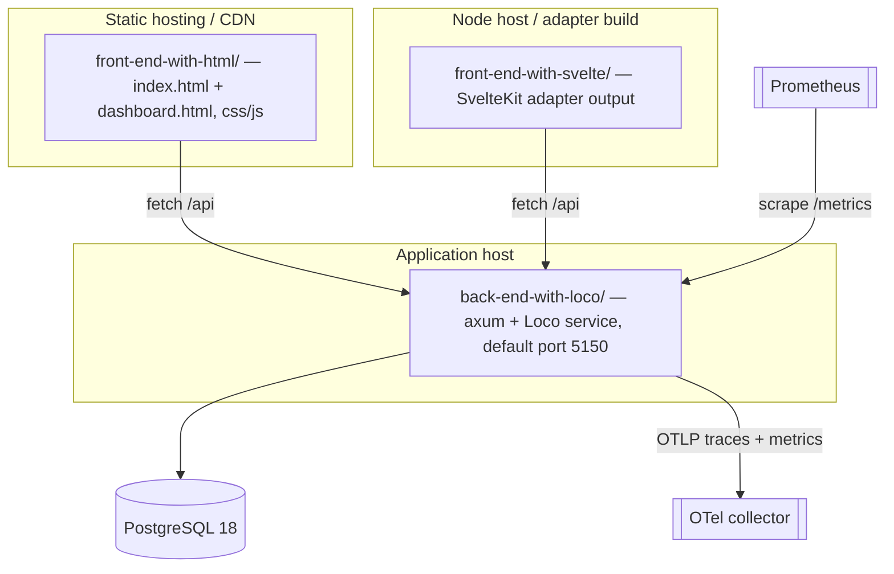

# 7. Deployment View

## 7.1 Status: hosted deployment is out of scope today

Hosted deployment, infrastructure, authentication, and multi-tenancy are
explicitly **out of scope** for the current repository (`spec.md` §2). The
monorepo demonstrates the *design* across many domains; it does not ship a
running service. There is deliberately **no unified backend** — each form's
Loco crate is independently buildable and deployable.

This section therefore describes the **intended deployment shape** per form, so
the design is deployment-ready, without asserting that any environment exists.

## 7.2 Intended per-form deployment shape

Each form is three deployable artefacts plus a database, all independent:

| Artefact | Build | Runtime shape |
| -------- | ----- | ------------- |
| **HTML front-end** | none (no build step) | Static files served over HTTP or `file://`; self-contained; talks to the API via `fetch /api/...` with a sample-data fallback. |
| **Svelte front-end** | SvelteKit adapter build (`pnpm build`) | Adapter output (static or Node) served under `/<slug>/`; client-only SVAR grid on the dashboard route. |
| **Loco back-end** | `cargo build --release` | axum service (default port 5150); one crate per form; JSON API only. |
| **Database** | SeaORM migrations (`cargo loco db migrate`) | PostgreSQL 18; per-form databases `<slug_snake>_{development,test,production}`; production URL from `DATABASE_URL`. |
| **Observability** | built into each crate | OTLP export to a collector (`OTEL_EXPORTER_OTLP_ENDPOINT`); Prometheus `/metrics` scrape target on the same router. |

## 7.3 Configuration

Per-form Loco config lives in `config/{development,test,production}.yaml`.
Production reads secrets from the environment (`DATABASE_URL`, `PORT`, `HOST`,
`FRONTEND_URL` for CORS, `OTEL_EXPORTER_OTLP_ENDPOINT`, `OTEL_SERVICE_NAME`).
The Postgres-backed background queue reuses the main database URI; Loco creates
its own `loco_jobs` table on first start. Test config runs workers
`ForegroundBlocking` so queued jobs execute inline.
