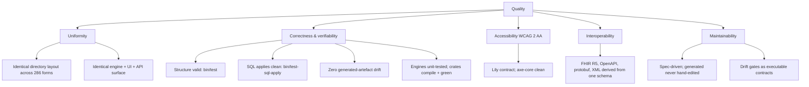

# 10. Quality Requirements

## 10.1 Quality tree



## 10.2 Quality scenarios

Each scenario is concrete and, where possible, backed by an executable gate.

| # | Quality | Stimulus | Expected response | Gate |
| - | ------- | -------- | ----------------- | ---- |
| Q1 | Correctness / interoperability | A maintainer changes a form's `sql/` schema and regenerates | All derived artefacts (XML, FHIR R5, protobuf, OpenAPI, Loco setup) regenerate with **zero drift** vs a fresh run | `bin/*-generate-* --check`, `bin/generate-*.py --check` |
| Q2 | Correctness | Every form's numbered SQL migrations are applied in order to a fresh scratch Postgres database | All migrations **apply cleanly** with no error | `bin/test-sql-apply` |
| Q3 | Accessibility | A front-end wizard is audited | It **passes axe-core** and honours the Lily contract (labels, error summary focus, `aria-invalid`, keyboard, AA contrast) | manual/CI axe-core; `bin/lily-html-refactor --check --all`, `bin/lily-svelte-refactor --check --all` |
| Q4 | Correctness | Every back-end crate is built and tested | Each crate **compiles and its tests pass** (`cargo build && cargo test`; clippy clean) | per-crate CI; batch build loop |
| Q5 | Uniformity | Any form directory is validated | Every required path exists and is non-empty; the layout matches the contract | `bin/test`, `bin/test-form <slug>` |
| Q6 | Uniformity / correctness | A Loco crate's queue or observability config drifts from convention | The drift detector **fails** and reports the missing feature/config | `bin/loco-config-refactor --check --all` |
| Q7 | Maintainability | A form is missing its living spec or `README` symlink | The spec presence check **fails** | `bin/generate-spec.py --check` |
| Q8 | Maintainability | The Lily upstream snapshot diverges from the pinned commit | The sync drift detector **fails** | `bin/lily-sync --check`, `bin/lily-svelte-sync --check` |

## 10.3 System-level acceptance

The green-across-the-board command set (`spec.md` §9, `AGENTS.md` Verify):

```sh
bin/test                                 # every form's structure
bin/test-sql-apply                       # SQL apply gate on a fresh DB
bin/lily-html-refactor --check --all     # Lily HTML contract drift
bin/lily-svelte-refactor --check --all   # Lily Svelte contract drift
bin/lily-sync --check                    # Lily HTML snapshot drift
bin/lily-svelte-sync --check             # Lily Svelte snapshot drift
bin/generate-llms-txt.py --check         # per-form llms.txt drift
bin/generate-spec.py --check             # per-form spec presence
bin/generate-changelog-and-examples.py --check   # CHANGELOG + examples drift
bin/loco-config-refactor --check --all   # Loco queue + observability drift
```
