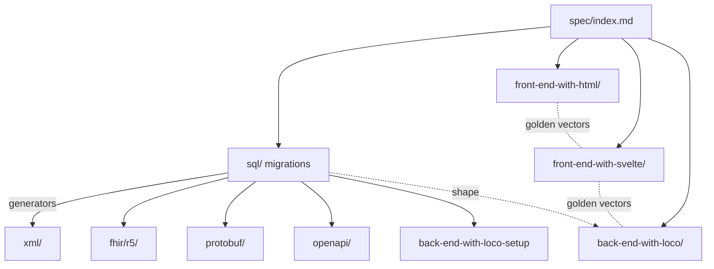

# Architecture

This is the one-page big picture. For depth, the full
[arc42](../arc42/index.md) architecture document is the intended home; this page
is the map you read first.

## The thesis: one shared design across many domains

The repo is a monorepo of **347 medical forms** (`forms/<slug>/`, counted by
[`forms.tsv`](../forms.tsv)). Each form is a different clinical domain — an
Apgar score, a stroke assessment, a cardiology referral — but every form is
built from the **same shape**. Learn one form and you can navigate all of them:
the directory layout, the SQL-first data model, the pure scoring engine, the two
front-ends, and the one back-end crate are identical in structure from slug to
slug. See the root [`AGENTS.md`](../AGENTS.md) "Form directory structure" for the
canonical layout and [`spec.md`](../spec.md) for the system contract.

The payoff of sameness: tooling. Because every form obeys the contract, a single
generator, a single Lily refactor, and a single test harness operate over the
whole corpus. Divergence is caught by `--check` drift gates rather than review.

## The per-form full stack

A single form carries a complete vertical slice:

- **`index.md` + `spec/index.md`** — human design and the machine-and-human
  spec. The spec is the source of truth for *behaviour*.
- **`sql/`** — numbered PostgreSQL migrations. The source of truth for *data
  shape*. Everything structural downstream is generated from here.
- **`xml/`, `fhir/r5/`, `protobuf/`, `openapi/`, `back-end-with-loco-setup`** —
  generated representations of the schema. Never hand-edited.
- **`front-end-with-html/`** — a Lily headless HTML wizard (`index.html`) plus a
  `dashboard.html`, driven by a vanilla-JS engine in `js/`.
- **`front-end-with-svelte/`** — a SvelteKit app using Lily Svelte components,
  routes nested under `src/routes/<slug>/`, RESTful `/<plural>/` list +
  `/<plural>/[id]` detail.
- **`back-end-with-loco/`** — a Rust axum + Loco JSON API crate, one relational
  table per SQL table.

The three implementations of the scoring logic (JS, TypeScript, Rust) are kept
in agreement by shared golden vectors — see [Scoring engines](scoring-engines.md).

## The spec-driven flow

Work flows one direction, top to bottom (spec.md §3.1):

```
index.md            human-readable design
   │
spec/index.md       the contract (source of truth for BEHAVIOUR)
   │
sql/                source of truth for DATA SHAPE
   │  generate ↓
   ├─► xml/         XML + DTD
   ├─► fhir/r5/     FHIR HL7 R5 JSON
   ├─► protobuf/    .proto schemas
   ├─► openapi/     OpenAPI 3.1 YAML
   └─► back-end-with-loco-setup   Loco scaffold script
```

Behaviour (the scoring engine, the UI wizard) is authored by hand from the spec
in each front-end and the back-end; data shape is generated from SQL. The rule
is: **update the spec before the code; regenerate derived artefacts after any
schema change.** Generated files are never hand-edited — the test of correctness
is regeneration idempotency.

## Data → artefacts → runtimes, at a glance



## Where to go next

- [Data model](data-model.md) — the relational schema and conventions.
- [Generator pipeline](generator-pipeline.md) — SQL → every derived artefact.
- [Scoring engines](scoring-engines.md) — the pure grading pattern in three
  languages.
- [Lily Design System](lily.md) — the headless UI contract.
- [Back end](back-end.md) — the Loco JSON API crate.
- [Verification](verification.md) — every gate and what it proves.
- [Tools reference](tools.md) — every `bin/` tool.
- Root [`README.md`](../README.md), [`spec.md`](../spec.md),
  [`CONTRIBUTING.md`](../CONTRIBUTING.md).
