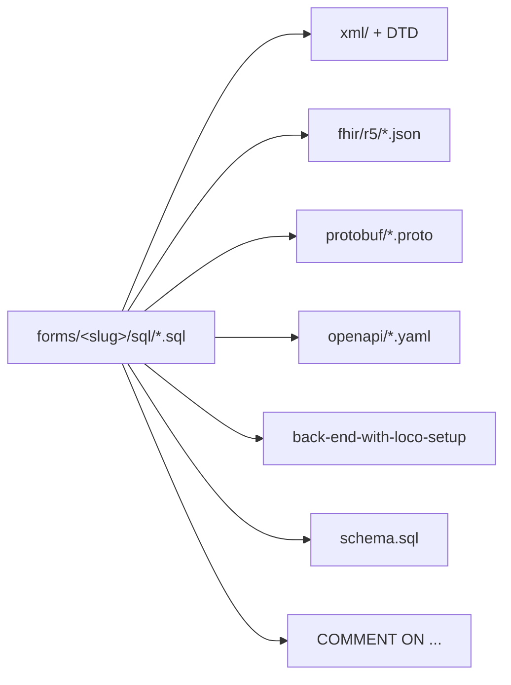

# Generator pipeline

The `sql/` migrations are the source of truth for data shape. From them, a set
of generators emit derived representations — one per table entity. Generated
artefacts are **never hand-edited**; the test of correctness is that a fresh
regeneration produces no diff (idempotence), enforced in CI.

See [Data model](data-model.md) for the SQL side and
[Verification](verification.md) for how the drift gates run.

## SQL → derived artefacts



Each generator walks every form's numbered `CREATE TABLE` migrations, parses the
columns and constraints, and writes one file per table entity into the target
directory.

## The generators and their outputs

| Generator | Output | Per-table produces |
|-----------|--------|--------------------|
| `bin/xml-representations/generate-xml-representations.py` | `xml/` | one `<table>.xml` sample + one `<table>.dtd` |
| `bin/fhir-r5/generate-fhir-r5-representations.py` | `fhir/r5/` | FHIR HL7 R5 JSON per entity |
| `bin/protobuf/generate-protobuf-representations.py` | `protobuf/` | a `.proto` schema per entity |
| `bin/openapi/generate-openapi-representations.py` | `openapi/` | an OpenAPI 3.1 `.yaml` per entity |
| `bin/back-end-with-loco/generate-back-end-with-loco-setup.py` | `back-end-with-loco-setup` | the `cargo loco generate scaffold --api` setup script |

Two SQL-side helpers keep the migrations themselves canonical:

- `bin/sql/generate-sql-comments.py` — appends missing `COMMENT ON TABLE` /
  `COMMENT ON COLUMN` to each numbered migration.
- `bin/sql/generate-sql-combined.py` — concatenates the numbered migrations into
  `schema.sql`.

Two more scaffold per-form derived docs from `index.md`/SQL:

- `bin/generate-llms-txt.py` — per-form `llms.txt` (llmstxt.org format).
- `bin/generate-changelog-and-examples.py` — per-form `CHANGELOG.md` and
  `examples/` (a filled-form JSON fixture + a FHIR R5 Bundle).

One more scaffolds the Loco crate's supply-chain policy:

- `bin/generate-loco-deny-config.py` — per-crate `back-end-with-loco/deny.toml`
  (cargo-deny license/advisory/bans/sources policy). Every crate shares the
  same `loco-rs` pin, so the policy is byte-identical across the corpus; see
  [Back end](back-end.md).

## Idempotence and the `--check` drift gates

Every generator supports a `--check` mode. It regenerates into memory (or a temp
location) and compares against the committed files, exiting non-zero on any
difference. This is the mechanism that lets CI assert "no uncommitted generated
diff" without trusting a human to have run the generator: CI regenerates
everything, then fails if `git` reports a change (see the **drift** job in
[Verification](verification.md)).

Because the generators are deterministic and idempotent, running them on a clean
checkout produces zero diff.

## Running them

Regenerate everything (the order in the root [`AGENTS.md`](../AGENTS.md)
"Standard workflow"):

```sh
python3 bin/xml-representations/generate-xml-representations.py
python3 bin/fhir-r5/generate-fhir-r5-representations.py
python3 bin/protobuf/generate-protobuf-representations.py
python3 bin/openapi/generate-openapi-representations.py
python3 bin/back-end-with-loco/generate-back-end-with-loco-setup.py
python3 bin/generate-loco-deny-config.py
python3 bin/generate-changelog-and-examples.py
```

Drift-check everything (what CI runs; each exits non-zero on drift):

```sh
python3 bin/xml-representations/generate-xml-representations.py --check
python3 bin/fhir-r5/generate-fhir-r5-representations.py --check
python3 bin/protobuf/generate-protobuf-representations.py --check
python3 bin/openapi/generate-openapi-representations.py --check
python3 bin/back-end-with-loco/generate-back-end-with-loco-setup.py --check
python3 bin/generate-loco-deny-config.py --check
python3 bin/generate-changelog-and-examples.py --check
python3 bin/generate-llms-txt.py --check
```

Most generators accept an optional list of slugs to scope to a subset, e.g.
`… --check apgar-score stroke-assessment`.

## Downstream validity

The generated output is not only diff-checked but validated: `xmllint --valid`
confirms each `xml/*.xml` validates against its DTD, and the official HL7
`validator_cli.jar` confirms each `fhir/r5/*.json` and example Bundle is valid
FHIR R5. See [Verification](verification.md).

For the full tool catalogue, see [Tools reference](tools.md) and
[`CONTRIBUTING.md`](../CONTRIBUTING.md).
